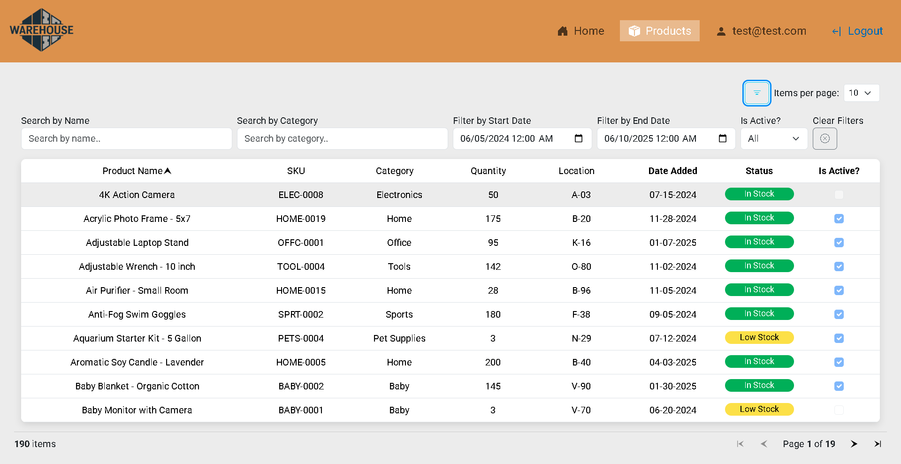
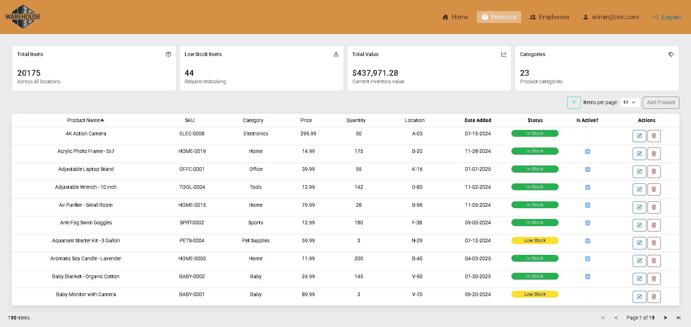

# Product Management System

Product Management System is a comprehensive ASP.NET Blazor web application designed for efficient warehouse inventory
management and employee administration. The system provides a role-based interface where employees can access and manage
product information including product names, SKU (Stock Keeping Unit) identifiers, warehouse locations, and stock
quantities. Enhanced financial visibility is granted to users with Manager and Admin roles, who can view cost prices,
profit margins, and other sensitive financial metrics. The platform features a robust employee management module that
enables Administrators to create new employee accounts, assign and modify user roles (Employee, Manager, Admin), and
maintain the organizational hierarchy. The application includes secure authentication with email-based account
confirmation, password reset functionality, and forgotten password recovery. Built with ASP.NET Blazor Server, the
system offers a responsive and interactive user interface with real-time updates and efficient data handling
capabilities.

Employee view:


Admin view:


## Features

- Create, edit, and delete product entries
- Employee management system with user creation and role assignment
- Role-based access control (Employee, Manager, Admin roles)
- Financial details visibility for Managers and Admins
- Email notifications for account confirmation, password reset, and forgotten password
- Responsive web interface built with ASP.NET Blazor
- External auth using Google, Facebook, GitHub, Microsoft and Twitter

## YouTube Video demo
[](https://www.youtube.com/watch?v=W6wU931eC2Y)

## Getting Started

1. Add this to appsettings.json to enable the email service:

   ```json
   {
     "Email": {
       "From": {
         "Address": "tremayne.kunze@ethereal.email",
         "Name": "Product Management System"
       },
       "Smtp": {
         "Host": "smtp.ethereal.email",
         "Port": "587",
         "Username": "tremayne.kunze@ethereal.email",
         "Password": "wGKmsApFwbc6hJtZW1"
       }
     }
   }
   ```

2. In [Ethereal Email](https://ethereal.email/) (A fake SMTP email service), login using the following credentials:
    - Username: tremayne.kunze@ethereal.email
    - Password: wGKmsApFwbc6hJtZW1

   

   Go to messages:
   

   Email confirmations, password reset emails and forgotten password emails will be sent here.

3. The database is seeded with two users:

   Admin Role:
    - Username: admin@test.com
    - Password: Password1!

   Employee Role:
    - Username: test@test.com
    - Password: Password1!

You can register as a new user, but will not have a role until assigned one by an admin. This can be done by signing in
as the admin role above and navigating to the employees menu in the navbar. Then clicking the edit button on the new
user and assigning the role there.

### Running the app

1. **Clone the repository:**

   ```bash
   git clone https://github.com/andymartinez1/ProductManagementSystem.git
   ```

2. **Navigate to the project directory:**

   ```bash
   cd ProductManagementSystem
   ```

3. **Restore dependencies:**

   ```bash
   dotnet restore
   ```

4. Build and run the app:
   ```bash
   dotnet build
   dotnet run
   ```

## Tech Stack

- **ASP.NET Core Blazor Server** - Web framework for building interactive web UIs
- **ASP.NET Core Identity** - Authentication and authorization framework
- **Entity Framework Core** - Object-relational mapper (ORM) for database operations
- **C# 14.0** - Primary programming language
- **Bootstrap** - CSS framework for responsive design
- **xUnit** - Testing framework for integration tests
- **SQL Server** - Relational database management system
- **SMTP Email Service** - Email notifications (Ethereal Email for development)
